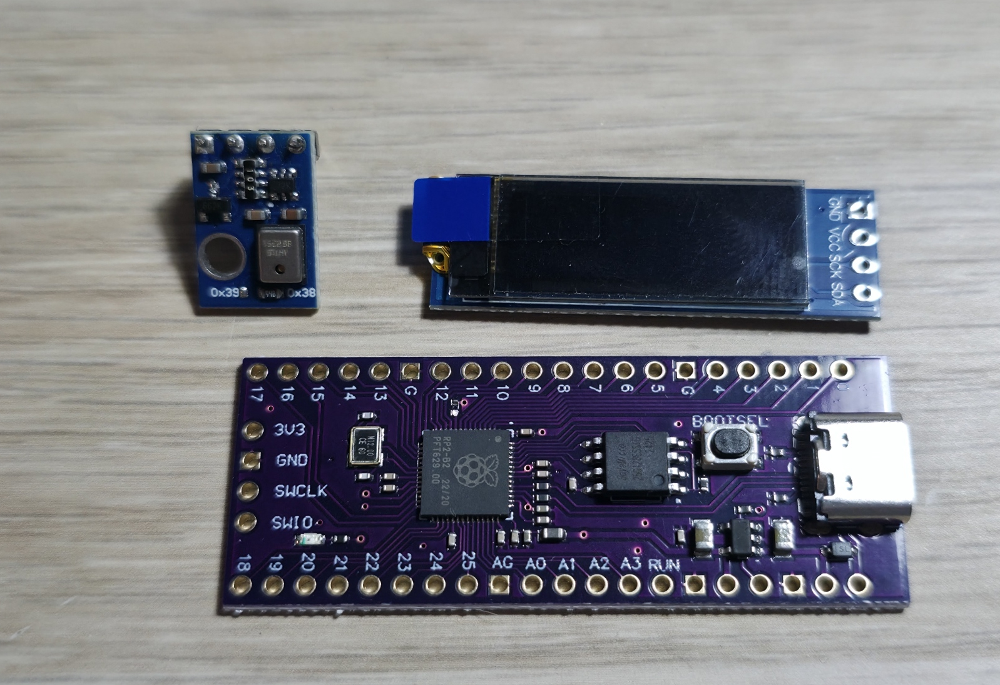

# Temperature / Humidity Display

### Hello!
This repository houses the material to make a small temperature / humidity display with a raspberry pi pico using python. 

Here is an overview of what the project currently does :
Powered by a 128x32 oled display, it shows you : 
- The current temperature (in Celcius, sorry not sorry Americans) and humidity percentage. 
- Time since the device has been powered on / plugged in
- Little icons to the left relating to the data collected by the sensor, I will explain that later on.
- (And just for info, the screen refreshes every second.)

See those 2 checkmarks I talked about earlier ? They are used for something very useful.

For the temperature :
- under 21°C, it shows a freezing icon
- above 25°C, it shows a fire icon

For the humidity :
- under 40%, it shows a desert tumbleweed icon
- above 60%, it shows a raining icon

And if the checkmarks are present, it means that the temperature / humidity are between the good limits :)

Now, for the parts and the "backend" of the project. 

As for the parts, it is very simple to do, you'll only need 3 of them :
- A raspberry pi pico of your choice (Mine is a pico 2 16Mb model)
- AHT10 Sensor / AHT20 Sensor (AHT20 Sensor not ready ! I have still not tested it, since it has a barometer function! Will come at some point...)
- A small 128x32 oled screen. (I recommend the one I have if you don't want to mess around with the drivers, which is the ssd1306.)

So let's first talk about the wiring, you'll need 8 cables. I recommend using jumper wires like I did when starting up everything. 
Here is the diagram I made :

### I just dropped the code in the /src folder if someone wants to take a look at it !